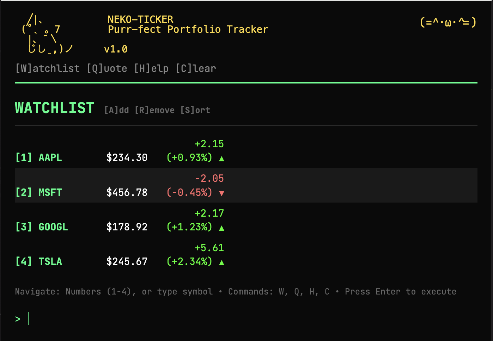

# NEKO-TICKER 🐱

**Purr-fect Portfolio Tracker** - A terminal-style stock portfolio tracker with a cat theme

```
  ╱|、          NEKO-TICKER
 (˚ˎ 。7        Purr-fect Portfolio Tracker
  |、˜〵      
  じしˍ,)ノ     v1.0
```



## Features

- **Terminal-style interface** with keyboard navigation
- **Real-time stock quotes** from Yahoo Finance API
- **Watchlist management** with persistent storage
- **ASCII charts** and visualizations
- **Cat mood indicators** that change based on portfolio performance
- **Responsive design** for desktop and mobile
- **Offline support** with cached data
- **Export functionality** for watchlists

## Quick Start

### Prerequisites
- [Bun](https://bun.sh/) runtime (recommended) or Node.js

### Installation

1. Clone or download the project
2. Navigate to the project directory
3. Install dependencies:
   ```bash
   bun install
   ```

### Running the Application

**Development mode (with hot reload):**
```bash
bun run dev
```

**Production mode:**
```bash
bun start
```

The application will be available at `http://localhost:3000`

## Usage

### Basic Commands

- **[W]** or `watchlist` - View your watchlist
- **[Q] \<symbol\>** - Get quote for a stock symbol
- **[A] \<symbol\>** - Add stock to watchlist
- **[R] \<symbol\>** - Remove stock from watchlist
- **[S] \<query\>** - Search for stocks
- **[H]** or `help` - Show help
- **[C]** or `clear` - Clear screen
- `export` - Export watchlist to CSV

### Navigation

- **Arrow Up/Down** - Command history
- **Escape** - Go back to main menu
- **Tab** - Auto-complete commands
- **1-9** - Select from search results
- Direct symbol entry (e.g., type `AAPL`)

### Examples

```bash
Q AAPL          # Get Apple stock quote
A TSLA          # Add Tesla to watchlist
S microsoft     # Search for Microsoft stocks
MSFT            # Direct symbol lookup
```

## Cat Moods

The cat changes expression based on your portfolio performance:

- **(=^-ω-^=)** - Happy (gains)
- **(=；ェ；=)** - Worried (losses)
- **(=^･ω･^=)** - Normal (neutral)
- **(^._.^)~** - Loading

## Technical Details

### Architecture

- **Frontend**: Vanilla JavaScript with terminal-style UI
- **Backend**: Bun server with proxy API endpoints
- **Data**: Yahoo Finance API with 1-minute caching
- **Storage**: localStorage for watchlist and cache
- **Styling**: CSS with monospace font (JetBrains Mono)

### API Endpoints

- `GET /api/quote?symbol=AAPL` - Get stock quote
- `GET /api/search?q=apple` - Search stocks

### Project Structure

```
neko-ticker/
├── index.html              # Main HTML file
├── server.js               # Bun server
├── package.json           # Dependencies
├── src/
│   ├── js/
│   │   ├── app.js         # Main application
│   │   ├── terminal.js    # Terminal UI handler
│   │   ├── api.js         # API integration
│   │   ├── storage.js     # localStorage manager
│   │   └── chart.js       # ASCII chart generator
│   └── css/
│       └── style.css      # Styling
└── README.md              # This file
```

## Features in Detail

### Real-time Updates
- Prices update every 30 seconds
- Automatic mood changes based on portfolio performance
- Graceful handling of network issues

### Caching
- 1-minute cache for API responses
- Offline functionality with cached data
- Automatic cache cleanup

### Keyboard Shortcuts
- Full keyboard navigation
- Command history with arrow keys
- Quick selection with number keys
- Tab completion for commands

### Export/Import
- Export watchlist to CSV
- Persistent storage across sessions

## Development

### Adding New Commands

1. Add command handler in `terminal.js`
2. Update help text and documentation
3. Add any required API endpoints in `server.js`

### Customization

- **Colors**: Edit CSS variables in `style.css`
- **Cat expressions**: Modify mood mappings in `terminal.js`
- **API source**: Update endpoints in `api.js`

## Troubleshooting

### Common Issues

1. **API not working**: Check internet connection and try again
2. **Prices not updating**: Refresh the page or check network
3. **Watchlist not saving**: Ensure localStorage is enabled
4. **Symbols not found**: Try searching first with `S` command

### Browser Compatibility

- Chrome/Edge: Full support
- Firefox: Full support
- Safari: Full support
- Mobile browsers: Responsive design

## License

MIT License - Feel free to use and modify!

## Contributing

1. Fork the project
2. Create your feature branch
3. Commit your changes
4. Push to the branch
5. Open a Pull Request

---

**Made with ❤️ and 🐱 by the NEKO-TICKER team**

*"The purr-fect way to track your investments!"*